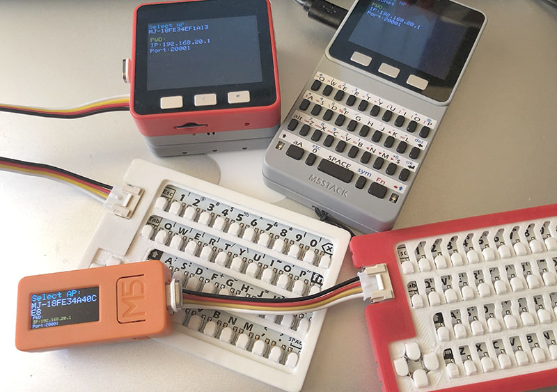
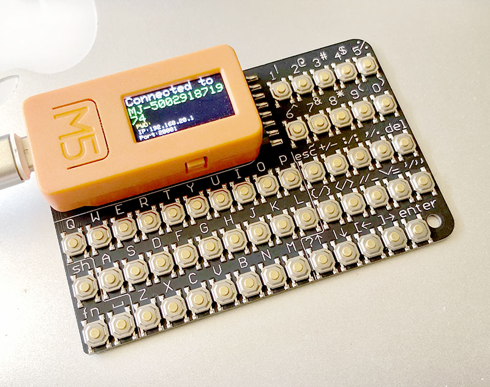
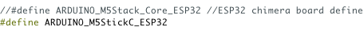
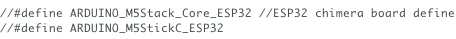
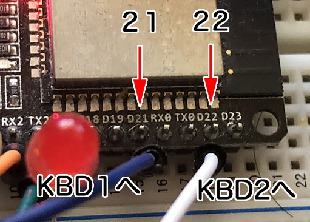
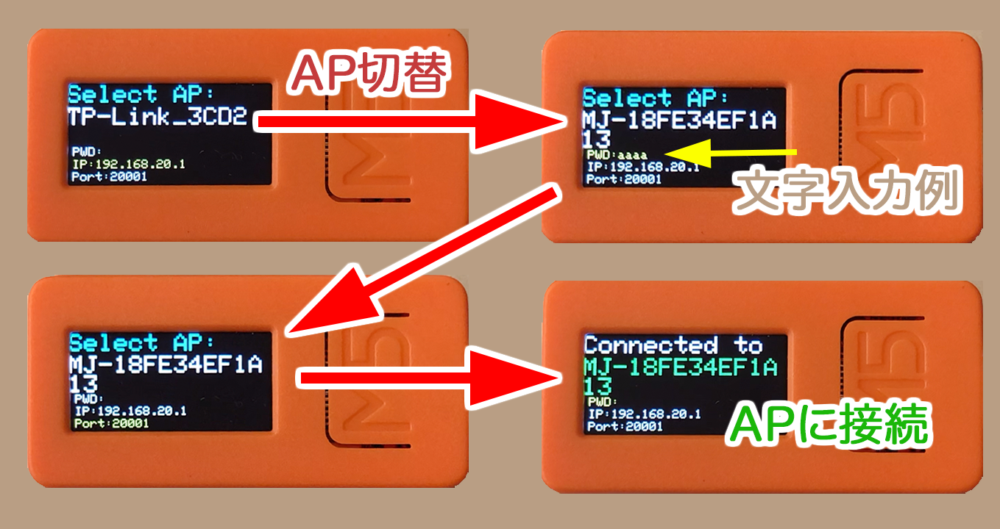
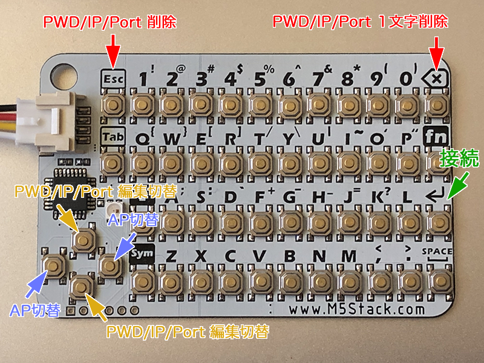
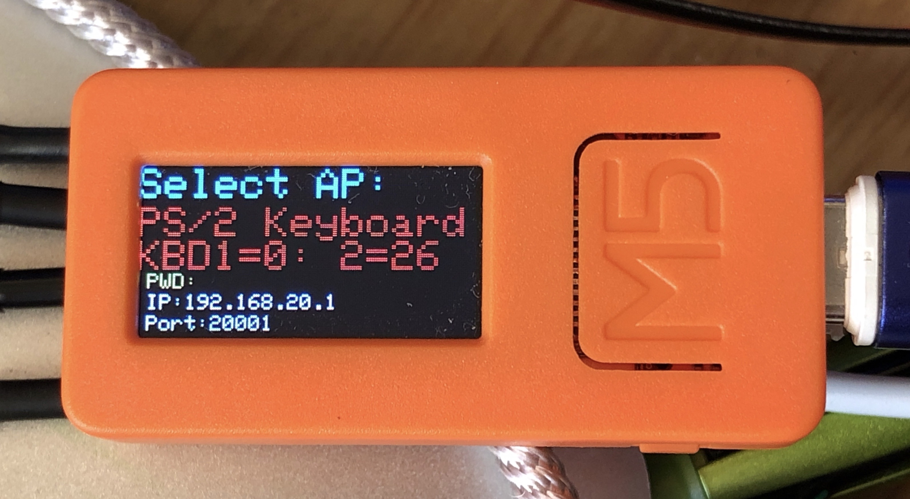
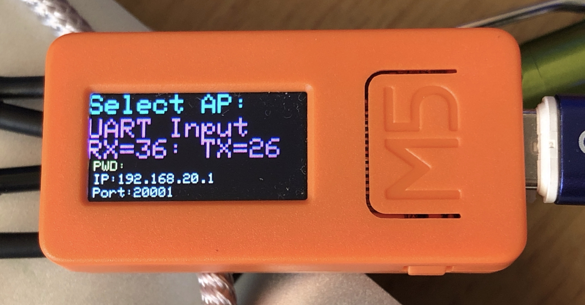

# M5CardKB\_for\_MJ
**MJ（MixJuiceまたはMicJack)** を装着したIchigoJamに、ワイヤレスで文字を入力できるようにするArduinoのスケッチです（バイナリーも入ってます）。M5StackまたはM5StickCに**CardKBユニット**を繋げて、もしくは、**M5Stack FACES**のキーボードを使って、**MJ**に入力した文字を送信します。

#### 主な更新内容
##### v1.3.1b1 (2020/6/21)
- HAT CardKBの矢印キーの４つをシフトなしの?,|,{,}と入れ替えた 

##### v1.3.0b1 (2020/6/19)
- HAT CardKBに対応 

##### v1.2.0b1 (2020/5/24)
- 無線を使わずに有線でM5StackまたはM5StickCを介してCardKBからIchigoJamに文字入力できるように対応（CardKBからの信号をPS/2信号に変換, またはUARTで送信します）

##### v1.1.0b1 (2020/4/30)
- Serialからの入力にも対応（IJUtilitiesで文字入力やプログラムの転送が無線でできます）

##### v1.0.0b1 (2020/4/29)
- 公開

## BINをインストールする方法

### M5Burner\_Micを使う場合

- [M5Burner\_Mic](http://micutil.com/download/M5Burner_Mic.zip)をダウンロード・インストールする。
- M5CardKB\_for\_MJの中にあるbinフォルダの中の**M5CardKB\_for\_MJフォルダ**をM5Burner\_Micの**firmwaresフォルダ**の中にコピーします。
- M5StackCまたはM5StackをUSB-Cケーブルでコンピュータと接続する。
- M5Burner\_Micを起動する。
- 「Port」を設定する。*複数台のESP機器がつながっている場合、ポートを間違えない様に注意して下さい。*
- 「Priset」で**「M5CardKB\_for\_MJ (M5Stack)」**、**「M5CardKB\_for\_MJ (M5StickC)」**などを選択する。
- 「Start」でインストールが始まります。

### IJUtilities（v0.9.9d12以降）を使う場合

- M5CardKB\_for\_MJの中にあるbinフォルダの中の**M5CardKB\_for\_MJフォルダ**をIJUtilitiesの**firmwaresフォルダ**の中にコピーします。
- M5StackCまたはM5StackをUSB-Cケーブルでコンピュータと接続する。
- IJUtilties を起動する。
- オプションメニューのESPTool (MixJuiceなど）を選択する
- 「Port」を設定する。*複数台のESP機器がつながっている場合、ポートを間違えない様に注意して下さい。*
-  ボーレートは、適切な数値にしてください。
- 「Priset」で**「M5CardKB\_for\_MJ (M5Stack)」**、**「M5CardKB\_for\_MJ (M5StickC)」**などを選択する。
- 「Start」でインストールが始まります。

## Arduinoでビルドする場合

### M5StickCの場合
 
M5CardKB\_for\_MJ.inoのスケッチの最初の方にある上記の部分で、ARDUINO\_M5StickC\_ESP32のコメントを外します。ボード設定はデフォルトです。 

### M5Stackの場合
 
M5CardKB\_for\_MJ.inoのスケッチの最初の方にある上記の部分で、ARDUINO\_M5StickC\_ESP32のコメントにしてください。ボード設定はデフォルトです。 

## MixJuice/MicJackの配線
**MixJuice**では、CN4 の **IO16 (上から6番目)** と **GND** を 接続して起動するとアクセスポイントモードになり、下記のサーバが動作します。***_MicJackでは、そのような配線は必要ありません。_***

 
	- SSID: MJ-XXXXXXXXXXXX (XX.. には MixJuice/MicJack の Mac アドレスが入ります)
	- WiFiパスワード: なし
	- IPアドレス: 192.168.20.1
	- UDPサーバ ポート: 20001
	

#### キーボードの信号としてIchigoJamに文字を送る場合の配線（MicJackのみの機能）
MicJackでは、IchigoJamに文字信号を送る場合に、TXを使って送るのではなく、キーボードから入力された信号と同じ様に信号を送ることができます。

1. 配線の前にIchigoJamの電源を切る。
2. 実際のキーボードをIchigoJamから外す。
3. 以下の配線を行なう。
	
	##### ESP8266の場合
		- ESP8266の**IO13**とIchigoJamの**KBD1**を接続
		- ESP8266の**IO16**とIchigoJamの**KBD2**を接続
	
	##### ESP32の場合
		- ESP32の**IO21**とIchigoJamの**KBD1**を接続
		- ESP32の**IO22**とIchigoJamの**KBD2**を接続

	

## 操作方法

- **アクセスポイントのスキャン**：起動時に自動的にスキャンします。再スキャンしたい場合は、M5Stackの**Cボタン**または、M5StickCの**電源ボタン(Aボタンの左側面)**を押してください。
- **別のアクセスポイントを表示**：M5StackまたはM5StickCの**Bボタン**または、キーボードの左右キーで変更することができます。
- **パスワード,リモートIP, ポートの変更**：**黄色の文字**で表示されている項目の編集ができます。**上下キー**を押すことで、パスワード、リモートIP、リモートポートを切り替えることができます。**デリートキー**で後ろから一文字ごと消去できます。**ESCキー**で、その項目の文字を全部消去できます。MixJuiceおよびMicJackはデフォルトでは、アクセスポイントの名称は**MJ-**から始まる名称になっています。またパスワード**無し**です。リモートIPは**192.168.20.1**に、リモートポートは**20001**になっています。
- **アクセスポイントに接続**：M5StackまたはM5StickCの**Aボタン**または、キーボードの**リターンキー**で接続することができます。接続が完了すると**「Connected to」と表示**されAP名が**緑色**の表示に変わります。キーボードから文字を入力して下さい。MixJuice/MicJackに送信された文字はTXによりIchigoJamに文字が送信されます。またMicJuckでは、キーボード信号として送信することも可能です（前述）。
- **接続を解除する**：アクセスポイントを再スキャンすると接続は解除されます。つまり、**Cボタン**または、M5StickCの**電源ボタン(Aボタンの左側面)**を押してください。

 
	

## 無線を使わずに、IchigoJamに繋げて、入力する方法

#### KBD1・KBD2（＝USB端子）に繋げる場合
- Bボタンを何回か押して、表示を「PS/2 Keyboard」に切り替える（写真） 注）IchigoJamの電源をOFF/ONする必要がある場合があります。5Vは必要に応じて接続して下さい。

接続するポート番号

| IchigoJam | M5StickC | M5Stack |
|---|---|---|
| KBD1 | io 0 | io 21 |
| KBD2 | io 26 | io 22 |
| GND | GND | GND |
| 5V | 5V | 5V |

#### TX (/RX) に繋げる場合
- Bボタンを何回か押して、表示を「UART input」に切り替える（写真） 注）RXは接続の必要はありません。5Vは必要に応じて接続して下さい。

接続するポート番号（普通のCardKBの場合）

| IchigoJam | M5StickC | M5Stack | 
|---|---|---|
| RX | io 36 | io 16 |
| TX | io 26 | io 17 |
| GND | GND | GND |
| 5V | 5V | 5V |

接続するポート番号（**HAT CardKBの場合**）

| IchigoJam | M5StickC |
|---|---|---|
| RX | io 32 (GROVE) |
| TX | io 33 (GROVE) |
| GND | GND |

## ライセンス
CC BY Micono